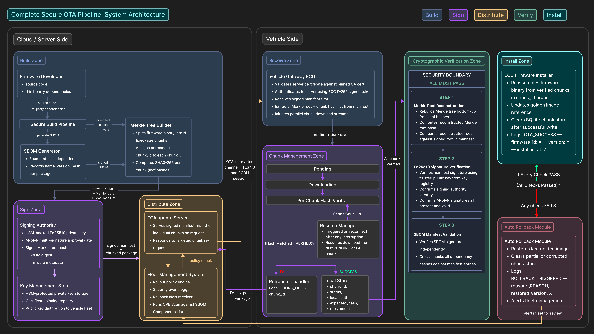

# Secure Distributed OTA Update System

A secure and distributed Over-The-Air (OTA) firmware update system for automotive ECUs, built on an **HSM-based Trust-Anchor architecture**. It demonstrates real-world cybersecurity scenarios including MITM attacks, supply chain validation, cryptographic verification, and safe-state rollback mechanisms.

Built with Python, FastAPI, and a real-time fleet management dashboard.

---

## Table of Contents

- [Features](#features)
- [Architecture](#architecture)
- [Project Structure](#project-structure)
- [Prerequisites](#prerequisites)
- [Installation](#installation)
- [Usage](#usage)
  - [Running the Dashboard](#running-the-dashboard)
  - [Running Demos via CLI](#running-demos-via-cli)
- [Demo Scenarios](#demo-scenarios)
- [Security Design](#security-design)
- [Tech Stack](#tech-stack)

---

## Features

- **Ed25519 Manifest Signing** — HSM-backed cryptographic signatures ensure firmware origin authenticity
- **HMAC-SHA256 Merkle Tree** — Per-chunk integrity verification prevents hash substitution attacks
- **SBOM Auditing** — Real-time dependency scanning against a CVE database blocks vulnerable firmware
- **Selective Retransmission** — Corrupted chunks are individually re-fetched with exponential backoff
- **Secure Resume** — Interrupted downloads persist verified chunk state to disk and resume seamlessly
- **Golden Image Rollback** — Failed installations atomically revert to the last known-good firmware
- **MITM Attack Simulation** — Transparent proxy simulates bitflip, truncation, and payload replacement attacks
- **Real-Time Dashboard** — Fleet management UI with live telemetry, chunk validation grid, and security alerts

---

## Architecture



---

## Project Structure

```
MAHE-Mobility-Final-Project/
│
├── main.py                      # Orchestrator — boots server or vehicle node
├── requirements.txt             # Python dependencies
├── readme.md                    # This file
│
├── common/                      # Shared infrastructure
│   ├── config.py                # Environment-driven configuration (ports, flags)
│   ├── logger.py                # Structured JSON logger with async dashboard forwarding
│   └── models.py                # Pydantic models (Manifest, UpdateRequest, SecurityEvent)
│
├── key_management/              # Cryptographic key store
│   └── hsm.py                   # Simulated Hardware Security Module (Ed25519)
│
├── signing/                     # Manifest signature authority
│   └── authority.py             # Signs and verifies version||merkle_root||sbom_hash
│
├── merkle/                      # Firmware integrity engine
│   └── tree.py                  # HMAC-SHA256 Merkle tree (build, verify, reconstruct)
│
├── sbom/                        # Software Bill of Materials
│   ├── generator.py             # Generates SBOM; injects vulnerable deps when FORCE_CVE=true
│   └── cve_database.json        # Local CVE threat feed for dependency scanning
│
├── build_pipeline/              # CI/CD firmware builder
│   └── builder.py               # SBOM → Merkle tree → HSM signing → Manifest assembly
│
├── server/                      # Cloud OTA distribution
│   └── ota_server.py            # FastAPI server (upload, manifest, chunk endpoints)
│
├── vehicle/                     # ECU cyber-physical system
│   ├── gateway_ecu.py           # Main OTA workflow (sig verify → SBOM → chunks → install)
│   ├── chunk_manager.py         # Chunk download with retry, resume, and HMAC verification
│   └── installer.py             # Safety interlocks, NAND flash simulation, golden image rollback
│
├── attacker/                    # MITM attack simulation
│   └── mitm.py                  # Bitflip, truncation, and payload replacement attacks
│
├── dashboard/                   # Fleet management UI
│   ├── app.py                   # FastAPI backend (log ingestion, metrics, demo runner)
│   └── index.html               # Single-page dashboard with real-time telemetry
│
├── scripts/                     # Pre-configured demo scenarios
│   ├── demo_1_normal.py         # Successful OTA update
│   ├── demo_2_tampered.py       # Persistent payload tampering attack
│   ├── demo_3_retransmit.py     # Chunk corruption with selective retransmission
│   ├── demo_4_resume.py         # Network interruption with secure resume
│   ├── demo_5_rogue_hsm.py      # Rogue server signature injection
│   ├── demo_6_sbom_cve.py       # SBOM CVE detection and force-patch
│   └── demo_7_rollback.py       # Automatic rollback to golden image
│
└── audit/                       # Persistent audit trail
    └── audit_log.json           # Auto-generated structured audit log (gitignored)
```

---

## Prerequisites

- **Python** 3.9+
- **pip** (Python package manager)
- **Git**

---

## Installation

### 1. Clone the Repository

```bash
git clone https://github.com/Akshaj05/MAHE-Mobility-Final-Project.git
cd MAHE-Mobility-Final-Project
```

### 2. Create a Virtual Environment

```bash
python3 -m venv venv
source venv/bin/activate    # macOS/Linux
# venv\Scripts\activate     # Windows
```

### 3. Install Dependencies

```bash
pip install -r requirements.txt
```

---

## Usage

### Running the Dashboard

The recommended way to run demos is through the **web dashboard**, which provides real-time visualization of all security events.

**Step 1:** Start the server node:

```bash
python main.py --server
```

This boots:
- **OTA Server** on `http://127.0.0.1:7000` — serves firmware manifests and chunks
- **Dashboard** on `http://127.0.0.1:7001` — fleet management UI

**Step 2:** Open `http://127.0.0.1:7001` in your browser.

**Step 3:** Select a demo scenario from the modal dialog and click **Run**.

The dashboard will display:
- **Metric Cards** — Updates, retransmissions, successes, corruptions, aborts
- **Payload Validation Grid** — 10-chunk visual state tracker (green/yellow/red/purple)
- **SBOM Alert Panel** — CVE detection and force-patch progression (Demo 6 only)
- **Telemetry Terminal** — Real-time structured log stream with color-coded severity

### Running Demos via CLI

Each demo can also be run standalone without the dashboard:

```bash
# Normal OTA update
python scripts/demo_1_normal.py

# Payload tampering attack
python scripts/demo_2_tampered.py

# Chunk corruption + retransmission
python scripts/demo_3_retransmit.py

# Network interruption + resume
python scripts/demo_4_resume.py

# Rogue HSM signature injection
python scripts/demo_5_rogue_hsm.py

# SBOM CVE detection + force-patch
python scripts/demo_6_sbom_cve.py

# Automatic rollback to golden image
python scripts/demo_7_rollback.py
```

Or manually with separate terminals:

```bash
# Terminal 1: Start server
python main.py --server

# Terminal 2: Run vehicle
python main.py --vehicle
```

---

## Demo Scenarios

### Demo 1 — Normal OTA Update
A clean firmware update with all 10 chunks downloaded, HMAC-verified, and installed successfully. No attacks, no failures.

### Demo 2 — Payload Tampering Attack
A persistent MITM attacker corrupts chunk 0 via bitflip on every attempt. The chunk manager detects the HMAC mismatch, exhausts retries, and aborts the update.

### Demo 3 — Chunk Loss & Retransmission
The MITM attacker corrupts chunk 4 on the first attempt but abates on retry. The chunk manager detects corruption, requests retransmission, and successfully completes the update.

### Demo 4 — Interrupted OTA with Secure Resume
The network drops at chunk 6. Verified chunk states are persisted to disk. On reconnection, the ECU resumes from chunk 6 without re-downloading chunks 0–5.

### Demo 5 — Rogue HSM Injection
The vehicle ECU boots with a randomly generated key that doesn't match the server's signing key. Ed25519 signature verification fails, and the update is rejected.

### Demo 6 — SBOM CVE Detection
The CI/CD pipeline is compromised and injects a vulnerable version of `libcurl` (7.88.1, matching CVE-2023-38545). The ECU detects the version mismatch, logs the CVE, forcefully patches the version, and continues the update.

### Demo 7 — Safe-State Rollback
A rogue server attempts to push firmware signed with an untrusted key. The ECU detects the signature failure, triggers an automatic rollback to the golden image (v1.0.0), and aborts the update.

---

## Security Design

| Layer | Mechanism | Threat Mitigated |
|-------|-----------|-----------------|
| **Transport** | ECDH session establishment | Eavesdropping, replay attacks |
| **Origin** | Ed25519 manifest signature via HSM | Rogue server injection, manifest tampering |
| **Integrity** | HMAC-SHA256 Merkle tree per chunk | Bitflip attacks, payload substitution |
| **Supply Chain** | SBOM dependency audit against CVE database | Vulnerable third-party components |
| **Resilience** | Selective retransmission with exponential backoff | Network corruption, packet loss |
| **Continuity** | Disk-persisted chunk state for resume | Network interruption, power loss |
| **Safety** | Battery threshold interlock (≥ 50%) | Mid-flash power failure |
| **Recovery** | Golden image rollback | Any unrecoverable failure |

---

## Tech Stack

| Component | Technology |
|-----------|-----------|
| Backend | Python 3.9+, FastAPI, Uvicorn |
| Cryptography | Ed25519 (signing), HMAC-SHA256 (integrity), SHA3-256 (hashing) |
| Data Models | Pydantic v2 |
| HTTP Client | Requests, HTTPX |
| Frontend | Vanilla HTML/CSS/JS |
| Logging | Structured JSON with async HTTP forwarding |

---

## License

This project was developed as part of the MAHE Mobility Hackathon Final Project.